```{r}
#| echo: false

library(tidyverse)
library(readxl)
library(janitor)
library(here)
library(gt)
library(rmarkdown)
library(palmerpenguins)
library(ggtext)
library(scales)
library(ggrepel)
library(marquee)
```

# Data Visualization {.inverse}

# Best Practices in Data Visualization {.inverse}

---

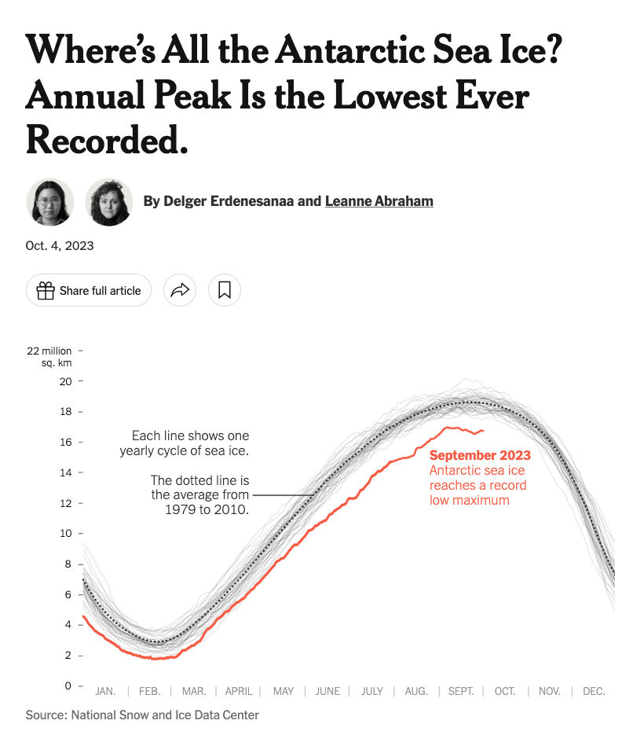{fig-width="100%"}

::: {.notes}
https://www.nytimes.com/2023/10/04/climate/antarctic-sea-ice-record-low.html
:::


---

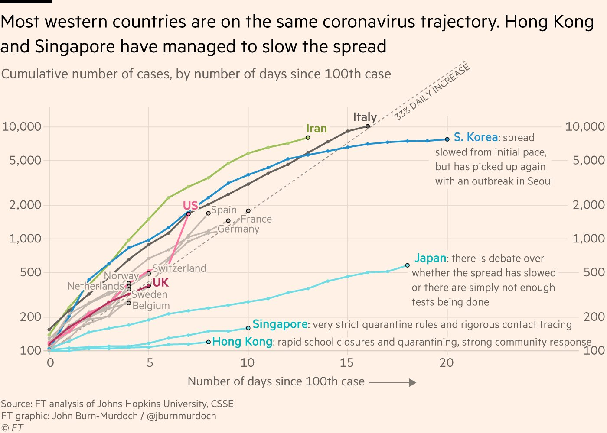{fig-width="100%"}

::: {.notes}
https://twitter.com/jburnmurdoch/status/1237737352879112194
:::


## Highlight {.has-bg-image background-image="assets/highlight.jpg"}

---

{fig-width="100%"}

---

{fig-width="100%"}

## Declutter {.has-bg-image background-image="assets/declutter.jpg"}


---

{fig-width="100%"}

---

{fig-width="100%"}

## Explain {.has-bg-image background-image="assets/explain.jpg"}


---

{fig-width="100%"}

---

{fig-width="100%"}

## Sparkle {.has-bg-image background-image="assets/sparkle.jpg"}

---

{fig-width="100%"}

---

{fig-width="100%"}

# Tidy Data {.has-bg-image background-image="assets/messy.jpg"}

## Can We Plot Untidy Data?

```{r}
#| echo: false
german_speakers_numeric <-
  read_excel(
    path = here("data-raw", "german-and-french-speakers.xlsx"),
    sheet = "German speakers",
    na = "-"
  ) |>
  clean_names()
```


```{r}
#| echo: true
#| output: true
german_speakers_numeric
```

---

## Can We Plot Untidy Data?

```{r}
#| echo: true
#| output: true
german_speakers_numeric
```

```{r}
#| eval: false
#| echo: true
#| code-line-numbers: "2"
ggplot(
  data = german_speakers_numeric,
  mapping = aes(
    # x = ???,
    y = state
  )
) +
  geom_col()
```


## Can We Plot Untidy Data?

```{r}
#| echo: true
german_speakers_tidy <-
  german_speakers_numeric |>
  pivot_longer(
    cols = -state,
    names_to = "year",
    values_to = "number"
  ) |>
  mutate(year = parse_number(year))
```

<br>

::: {.fragment}
```{r}
#| include: true
#| echo: true
german_speakers_tidy
```
:::


## Can We Plot Untidy Data?

```{r}
#| echo: true

ggplot(data = german_speakers_tidy, mapping = aes(x = number, y = state)) +
  geom_col() +
  facet_wrap(~year)
```

# Pipe Data Into ggplot {.has-bg-image background-image="assets/pipes.jpg"}

## Pipe Data Into ggplot

```{r}
#| echo: true
penguins |>
  filter(year == 2007) |>
  count(island)
```

## Pipe Data Into ggplot

```{r}
#| echo: true
penguins |>
  filter(year == 2007) |>
  count(island) |>
  ggplot(aes(x = n, y = island)) +
  geom_col()
```

## Pipe Data Into ggplot

```{r}
#| echo: true
#| code-line-numbers: "2"
penguins |>
  filter(year == 2008) |>
  count(island) |>
  ggplot(aes(x = n, y = island)) +
  geom_col()
```


## My Turn {.my-turn}

1. Create a new R script file.

1. Create a `data` directory using the `fs` package.

1. Download the third grade math proficiency data from the data wrangling section of the course into the `data` directory.

## My Turn, Continued {.my-turn}

4. Import the RDS file into a data frame called `third_grade_math_proficiency` and make a few modifications so it's easier to work with.

5. Make a plot by piping the third grade math proficiency data directly into ggplot.


## Your Turn {.your-turn}

1. Create a new R script file.

1. Download the enrollment data by race/ethnicity and create a data frame called `enrollment_by_race_ethnicity` using the starter code below.

1. Pipe your data into a bar chart that shows the breakdown of race/ethnicity among students in Beaverton SD 48J in 2022-2023.


# Highlight {.has-bg-image background-image="assets/highlight.jpg"}

# Reorder Plots to Highlight Findings {.has-bg-image background-image="assets/goya-cans.jpg"}

---

```{r}
#| echo: true
penguins |>
  count(island)
```

::: {.fragment}
```{r}
#| echo: true
#| fig-height: 3
penguins |>
  count(island) |>
  ggplot(aes(x = n, y = island)) +
  geom_col()
```
:::


---

```{r}
#| echo: true
#| code-line-numbers: "4"

penguins |>
  count(island) |>
  ggplot(aes(x = n, y = reorder(island, n))) +
  geom_col()
```

---

```{r}
#| echo: true
#| code-line-numbers: "3"

penguins |>
  count(island) |>
  mutate(island = fct_reorder(island, n)) |>
  ggplot(aes(x = n, y = island)) +
  geom_col()
```


## My Turn {.my-turn}

1. Reorder my bar chart so that it shows schools with the highest proficiency rates at the top.

## Your Turn {.your-turn}

1. Make a bar chart that shows race/ethnicity in Beaverton SD 48J. As before, filter your data to only include 2022-2023 data and only include Beaverton SD 48J. Then, do the following:

1. Using the `reorder()` function, make a bar chart that shows the percent of race/ethnicity groups in descending order

1. Make the same bar chart using `mutate()` and `fct_reorder()` to reorder the race/ethnicity groups


# Line Charts {.has-bg-image background-image="assets/lines.jpg"}

---

```{r}
#| echo: true
penguins |>
  count(year, island)
```


::: {.fragment}
```{r}
#| echo: true
#| fig-height: 2
penguins |>
  count(year, island) |>
  ggplot(aes(x = year, y = n)) +
  geom_line()
```
:::

---

```{r}
#| echo: true
penguins |>
  count(year, island)
```

::: {.fragment}
```{r}
#| echo: true
#| code-line-numbers: "5"
#| fig-height: 2
penguins |>
  count(year, island) |>
  ggplot(aes(x = year, y = n, group = island)) +
  geom_line()
```
:::


## My Turn {.my-turn}

Make a line chart that shows the change in proficiency levels from 2018-2019 to 2021-2022

## Your Turn {.your-turn}

Make a line chart that shows the change in the Hispanic/Latino population in school districts from 2021-2022 to 2022-2023

# Use Color to Highlight Findings {.has-bg-image background-image="assets/color.jpg"}

---

{fig-width="100%"}

---

{fig-width="100%"}

---

```{r}
penguins |>
  filter(year >= 2008) |>
  mutate(year = as.character(year)) |>
  group_by(island, year) |>
  summarize(mean_bill_length = mean(bill_length_mm, na.rm = TRUE)) |>
  ungroup() |>
  ggplot(aes(x = year, y = mean_bill_length, group = island)) +
  geom_line() +
  theme_minimal()
```


---

```{r}
penguins |>
  filter(year >= 2008) |>
  mutate(year = as.character(year)) |>
  group_by(island, year) |>
  summarize(mean_bill_length = mean(bill_length_mm, na.rm = TRUE)) |>
  ungroup() |>
  mutate(
    highlight_island = case_when(
      island == "Biscoe" ~ "Y",
      .default = "N"
    )
  ) |>
  ggplot(aes(
    x = year,
    y = mean_bill_length,
    color = highlight_island,
    group = island
  )) +
  geom_line() +
  scale_color_manual(
    values = c(
      "N" = "grey80",
      "Y" = "orange"
    )
  ) +
  theme_minimal() +
  theme(legend.position = "none")
```

## Use Color to Highlight Findings

::: {.fragment}
<br>
**Data wrangling**

1. Figure out which line you want to highlight

1. Create variable to highlight this line
:::

::: {.fragment}
**Data visualization**

1. Use the `color` aesthetic property combined with `scale_color_manual()` to highlight line
:::

## My Turn {.my-turn}

Highlight a single school in my line chart that showed growth in math proficiency between 2018-2019 and 2021-2022

## Your Turn {.your-turn}

Highlight the district in your line chart that had the largest increase in its Hispanic/Latino population between 2021-2022 and 2022-2023

# Declutter {.has-bg-image background-image="assets/declutter.jpg"}

---

{fig-width="100%"}

---

{fig-width="100%"}

---

```{r}
penguins_bill_length_plot <-
  penguins |>
  filter(year >= 2008) |>
  mutate(year = as.character(year)) |>
  group_by(island, year) |>
  summarize(mean_bill_length = mean(bill_length_mm, na.rm = TRUE)) |>
  ungroup() |>
  mutate(
    highlight_island = case_when(
      island == "Biscoe" ~ "Y",
      .default = "N"
    )
  ) |>
  ggplot(aes(
    x = year,
    y = mean_bill_length,
    color = highlight_island,
    group = island
  )) +
  geom_line() +
  scale_color_manual(
    values = c(
      "N" = "grey80",
      "Y" = "orange"
    )
  )

penguins_bill_length_plot
```

## Complete Themes

Complete themes like `theme_minimal()` completely change the look and feel of plots

::: {.fragment}
```{r}
#| echo: true
#| fig-height: 4
penguins_bill_length_plot +
  theme_minimal()
```
:::

::: {.notes}
https://ggplot2.tidyverse.org/reference/ggtheme.html
:::


## `
theme()
` Function

The `
theme()
` function allows you to alter specific pieces of your plots.

::: {.fragment}
You usually use the `
theme()
` function after setting a complete theme.
:::


## `
theme()
` Function

```{r}
#| echo: true
#| code-line-numbers: "3"
penguins_bill_length_plot +
  theme_minimal() +
  theme(axis.title = element_blank())
```


## `theme()` Function

Within the `theme()` function, we need to figure out two pieces:

1. What part of the plot are we targeting?

1. What do we want to change on that part of the plot?

## Plot Parts

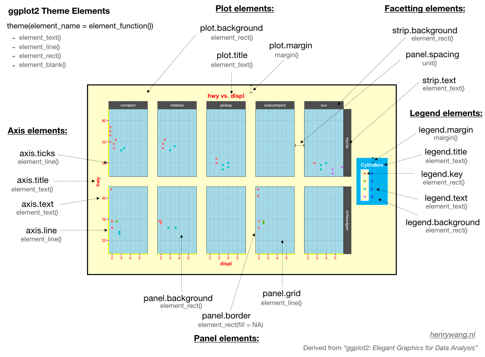{fig-width="100%"}

## `element_` Functions

- `element_blank()`

- `element_rect()`

- `element_line()`

- `element_text()`

## `element_blank()`

```{r}
#| echo: true
#| fig-height: 2
penguins_bill_length_plot +
  theme_minimal()
```

::: {.fragment}
```{r}
#| echo: true
#| code-line-numbers: "3"
#| fig-height: 2
penguins_bill_length_plot +
  theme_minimal() +
  theme(axis.title = element_blank())
```
:::

## Remove Legends

```{r}
#| echo: true
#| code-line-numbers: "2"
penguins_bill_length_plot +
  theme(legend.position = "none")
```

## `element_rect()`

```{r}
#| echo: true
#| code-line-numbers: "3-5"
penguins_bill_length_plot +
  theme_minimal() +
  theme(
    plot.background = element_rect(
      fill = "blue",
      color = "orange",
      linewidth = 5
    )
  )
```

## `element_rect()`

```{r}
#| echo: true
#| eval: false
element_rect(
  fill = NULL,
  colour = NULL,
  linewidth = NULL,
  linetype = NULL,
  color = NULL,
  inherit.blank = FALSE,
  size = deprecated()
)
```


## `element_line()`

```{r}
#| echo: true
#| code-line-numbers: "3-5"
penguins_bill_length_plot +
  theme_minimal() +
  theme(
    panel.grid.major = element_line(color = "blue"),
    panel.grid.minor = element_line(color = "red")
  )
```

## `element_line()`

```{r}
#| echo: true
#| eval: false
element_line(
  colour = NULL,
  linewidth = NULL,
  linetype = NULL,
  lineend = NULL,
  color = NULL,
  arrow = NULL,
  inherit.blank = FALSE,
  size = deprecated()
)
```

## `element_text()`

```{r}
#| echo: true
#| code-line-numbers: "3-6"
penguins_bill_length_plot +
  theme_minimal() +
  theme(
    axis.text = element_text(
      family = "Times New Roman",
      face = "bold",
      size = 20,
      color = "blue"
    )
  )
```


## `element_text()`

```{r}
#| echo: true
#| eval: false
element_text(
  family = NULL,
  face = NULL,
  colour = NULL,
  size = NULL,
  hjust = NULL,
  vjust = NULL,
  angle = NULL,
  lineheight = NULL,
  color = NULL,
  margin = NULL,
  debug = NULL,
  inherit.blank = FALSE
)
```

## My Turn {.my-turn}

1. Remove the gray background

1. Remove axis titles

1. Remove the legend

1. Remove or minimize grid lines

::: {.notes}
- Talk about complete themes vs theme()
- Explain this lesson is about using theme()
- Show Henry Wang image
- Explain I'm just showing a few tweaks
:::

## Your Turn {.your-turn}

1. Remove the gray background

1. Remove axis titles

1. Remove the legend

1. Remove or minimize grid lines

# Explain {.has-bg-image background-image="assets/explain.jpg"}

---

{fig-width="100%"}

::: {.notes}
Section is about using text to explain
:::

# Add Descriptive Labels to Your Plots {.inverse}

---

{fig-width="100%"}

---

{fig-width="100%"}

---

```{r}
penguins |>
  filter(year >= 2008) |>
  mutate(year = as.character(year)) |>
  group_by(island, year) |>
  summarize(mean_bill_length = mean(bill_length_mm, na.rm = TRUE)) |>
  ungroup() |>
  mutate(
    highlight_island = case_when(
      island == "Biscoe" ~ "Y",
      .default = "N"
    )
  ) |>
  mutate(
    text_label = case_when(
      island == "Biscoe" & year == 2009 ~ str_glue(
        "Average bill length
                                                 {number(mean_bill_length, accuracy = 0.1)} mm"
      ),
      island == "Biscoe" & year == 2008 ~ number(
        mean_bill_length,
        accuracy = 0.1
      )
    )
  ) |>
  ggplot(aes(
    x = year,
    y = mean_bill_length,
    color = highlight_island,
    label = text_label,
    group = island
  )) +
  geom_line() +
  geom_text_repel(
    hjust = 0,
    seed = 1234,
    force = 25,
    segment.color = "transparent",
    direction = "x",
    lineheight = 0.9
  ) +
  scale_color_manual(
    values = c(
      "N" = "grey80",
      "Y" = "orange"
    )
  ) +
  theme_minimal() +
  theme(
    axis.title = element_blank(),
    panel.grid = element_blank(),
    legend.position = "none"
  )
```


## My Turn {.my-turn}

1. Add text labels to show the percentage of proficient students in my highlight school in each year

1. Format my axis text so it shows percentages

::: {.notes}
- Direct labeling
- Create text labels
- Show how to make all labels (https://show.rfor.us/rWJ5qnH3)
- Show ggrepel
- Axis text (either format it nicely or remove it)
:::

## Your Turn {.your-turn}

1. Add text labels to show the percentage of Hispanic/Latino students in the highlight district in each year

1. Format the axis text so it shows percentages


# Use Titles to Highlight Findings {.inverse}

---

{fig-width="100%"}


---

{fig-width="100%"}


## Add Descriptive Titles

```{r}
penguins |>
  filter(year >= 2008) |>
  mutate(year = as.character(year)) |>
  group_by(island, year) |>
  summarize(mean_bill_length = mean(bill_length_mm, na.rm = TRUE)) |>
  ungroup() |>
  mutate(
    highlight_island = case_when(
      island == "Biscoe" ~ "Y",
      .default = "N"
    )
  ) |>
  mutate(
    text_label = case_when(
      island == "Biscoe" & year == 2009 ~ str_glue(
        "Average bill length
                                                 {number(mean_bill_length, accuracy = 0.1)} mm"
      ),
      island == "Biscoe" & year == 2008 ~ number(
        mean_bill_length,
        accuracy = 0.1
      )
    )
  ) |>
  ggplot(aes(
    x = year,
    y = mean_bill_length,
    color = highlight_island,
    label = text_label,
    group = island
  )) +
  geom_line() +
  geom_text_repel(
    hjust = 0,
    seed = 1234,
    force = 25,
    segment.color = "transparent",
    direction = "x",
    lineheight = 0.9
  ) +
  scale_color_manual(
    values = c(
      "N" = "grey80",
      "Y" = "orange"
    )
  ) +
  labs(
    title = "Penguins on Biscoe island had the longest average bill length in 2008 and 2009"
  ) +
  theme_minimal() +
  theme(
    axis.title = element_blank(),
    panel.grid = element_blank(),
    plot.title = element_text(face = "bold", size = 16),
    plot.title.position = "plot",
    legend.position = "none"
  )
```

## Use Color in Titles to Highlight Findings

```{r}
penguins |>
  filter(year >= 2008) |>
  mutate(year = as.character(year)) |>
  group_by(island, year) |>
  summarize(mean_bill_length = mean(bill_length_mm, na.rm = TRUE)) |>
  ungroup() |>
  mutate(
    highlight_island = case_when(
      island == "Biscoe" ~ "Y",
      .default = "N"
    )
  ) |>
  mutate(
    text_label = case_when(
      island == "Biscoe" & year == 2009 ~ str_glue(
        "Average bill length
                                                 {number(mean_bill_length, accuracy = 0.1)} mm"
      ),
      island == "Biscoe" & year == 2008 ~ number(
        mean_bill_length,
        accuracy = 0.1
      )
    )
  ) |>
  ggplot(aes(
    x = year,
    y = mean_bill_length,
    color = highlight_island,
    label = text_label,
    group = island
  )) +
  geom_line() +
  geom_text_repel(
    hjust = 0,
    seed = 1234,
    force = 25,
    segment.color = "transparent",
    direction = "x",
    lineheight = 0.9
  ) +
  scale_color_manual(
    values = c(
      "N" = "grey80",
      "Y" = "orange"
    )
  ) +
  labs(
    title = "{.orange **Penguins on Biscoe island**} had the longest average bill length in 2008 and 2009"
  ) +
  theme_minimal() +
  theme(
    axis.title = element_blank(),
    panel.grid = element_blank(),
    plot.title = element_marquee(size = 16),
    plot.title.position = "plot",
    legend.position = "none"
  )
```

## {marquee}

. . .

Add markdown in your title

```{r}
#| eval: false
#| echo: true
 labs(
    title = "**Penguins on Biscoe island**
      had the longest average bill length in 2008 and 2009"
  )
```

. . .

```{r}
#| eval: false
#| echo: true
 labs(
    title = "{.orange **Penguins on Biscoe island**}
      had the longest average bill length in 2008 and 2009"
  )
```

. . .

::: {.fragment}
And then tell ggplot to interpret the title as markdown
```{r}
#| eval: false
#| echo: true
theme(plot.title = element_marquee())
```
:::


## My Turn {.my-turn}

1. Add a descriptive title to my plot

1. Use color strategically in my title using the {marquee} package

1. Align my title all the way to the edge of the plot

::: {.notes}
- Use descriptive titles
- Use color in titles
- Show datawrapper articles
- plot.title.position = "plot"
:::

## Your Turn {.your-turn}

1. Add a descriptive title to your plot

1. Use color strategically in your title using the {maruqee} package

1. Align your title all the way to the edge of the plot

# Use Annotations to Explain {.inverse}

---

{fig-width="100%"}

---

{fig-width="100%"}

---

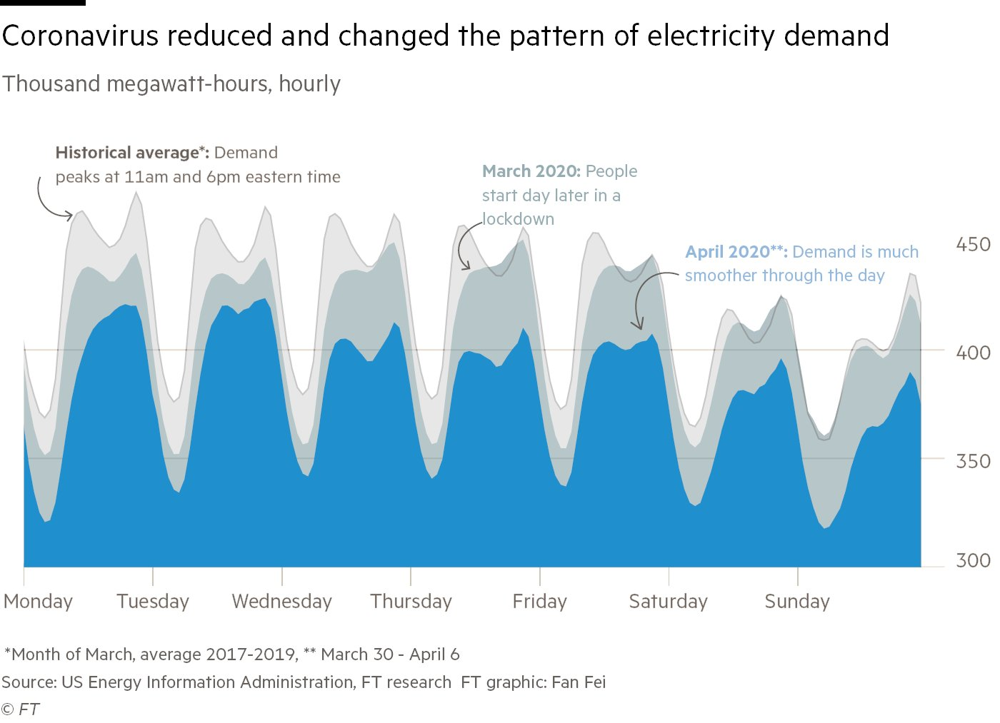{fig-width="100%"}


```{r}
penguins_plot_with_color_title <-
  penguins |>
  filter(year >= 2008) |>
  mutate(year = as.character(year)) |>
  group_by(island, year) |>
  summarize(mean_bill_length = mean(bill_length_mm, na.rm = TRUE)) |>
  ungroup() |>
  mutate(
    highlight_island = case_when(
      island == "Biscoe" ~ "Y",
      .default = "N"
    )
  ) |>
  mutate(
    text_label = case_when(
      island == "Biscoe" & year == 2009 ~ str_glue(
        "Average bill length
                                                 {number(mean_bill_length, accuracy = 0.1)} mm"
      ),
      island == "Biscoe" & year == 2008 ~ number(
        mean_bill_length,
        accuracy = 0.1
      )
    )
  ) |>
  ggplot(aes(
    x = year,
    y = mean_bill_length,
    color = highlight_island,
    label = text_label,
    group = island
  )) +
  geom_line() +
  geom_text_repel(
    hjust = 0,
    seed = 1234,
    force = 25,
    segment.color = "transparent",
    direction = "x",
    lineheight = 0.9
  ) +
  scale_color_manual(
    values = c(
      "N" = "grey80",
      "Y" = "orange"
    )
  ) +
  labs(
    title = "<b style='color: orange;'>Penguins on Biscoe island</b> had the longest average bill length in 2008 and 2009"
  ) +
  theme_minimal() +
  theme(
    axis.title = element_blank(),
    panel.grid = element_blank(),
    plot.title = element_markdown(size = 16),
    plot.title.position = "plot",
    legend.position = "none"
  )
```

## Use Annotations to Explain

```{r}
penguins_plot_with_color_title +
  annotate(
    geom = "text",
    x = "2009",
    y = 44,
    hjust = 0,
    lineheight = 0.9,
    color = "grey70",
    label = "Gray lines show\npenguins on other islands"
  )
```

## Use Annotations to Explain

```{r}
#| echo: true
penguins_plot_with_color_title +
  annotate(
    geom = "text",
    x = "2009",
    y = 44,
    hjust = 0,
    lineheight = 0.9,
    color = "grey70",
    label = "Grey lines show\npenguins on other islands"
  )
```


## My Turn {.my-turn}

1. Add an annotation to explain what the grey lines represent

::: {.notes}
- annotate() function
:::

## Your Turn {.your-turn}

1. Add an annotation to explain what the grey lines represent

# Make it Sparkle {.has-bg-image background-image="assets/sparkle.jpg"}

---

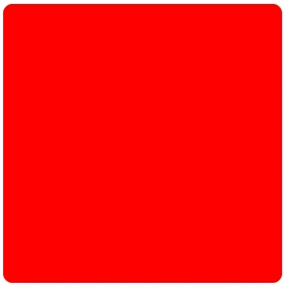{fig-width="100%"}


# Tweak Spacing {.inverse}

```{r}
penguins_plot_with_annotation <-
  penguins_plot_with_color_title +
  annotate(
    geom = "text",
    x = "2009",
    y = 44,
    hjust = 0,
    lineheight = 0.9,
    color = "grey70",
    label = "Grey lines show\npenguins on other islands"
  )
```


## Tweak Spacing

```{r}
penguins_plot_with_annotation
```


## Tweak Spacing

```{r}
#| echo: true
#| code-line-numbers: "2"
penguins_plot_with_annotation +
  scale_x_discrete(expand = expansion(add = c(1, 1)))
```

## Tweak Spacing

```{r}
#| echo: true
#| code-line-numbers: "2"
penguins_plot_with_annotation +
  scale_x_discrete(expand = expansion(mult = c(1, 1)))
```

## Tweak Spacing

```{r}
#| echo: true
#| code-line-numbers: "2"
penguins_plot_with_annotation +
  scale_x_discrete(expand = expansion(add = c(0, 0.5)))
```

## Tweak Spacing

```{r}
#| echo: true
#| code-line-numbers: "2"
penguins_plot_with_annotation +
  scale_x_discrete(expand = expansion(mult = c(0, 0.5)))
```

## Tweak Spacing

```{r}
#| echo: true
#| code-line-numbers: "2"
penguins_plot_with_annotation +
  scale_y_continuous(expand = expansion(add = c(0, 10)))
```

## Tweak Spacing

```{r}
#| echo: true
#| code-line-numbers: "2"
penguins_plot_with_annotation +
  scale_y_continuous(expand = expansion(mult = c(0, 10)))
```


## My Turn {.my-turn}

1. Tweak spacing around my plot to remove unnecessary blank spaces

## Your Turn {.your-turn}

1. Tweak spacing around your plot to remove unnecessary blank spaces

# Customize Your Theme {.inverse}

## Customize Your Theme

```{r}
penguins_bar_chart <-
  penguins |>
  filter(year == 2007) |>
  count(island) |>
  ggplot(aes(x = n, y = reorder(island, n), fill = island)) +
  geom_col() +
  geom_text(aes(label = n), nudge_x = -2) +
  scale_fill_manual(
    values = c(
      "Dream" = "orange",
      "Biscoe" = "grey80",
      "Torgersen" = "grey80"
    )
  ) +
  labs(title = "In 2007, Dream island had the most penguins of any island") +
  scale_x_continuous(expand = expansion(add = c(0.1, 0.5)))
```

```{r}
penguins_bar_chart
```

## Make a Custom Theme

```{r}
penguins_bar_chart <-
  penguins_bar_chart +
  labs(
    title = "In 2007, {.orange **Dream island**} had the most penguins of any island"
  )
```


```{r}
#| echo: true
penguins_bar_chart +
  theme_void() +
  theme(
    axis.text.y = element_text(),
    legend.position = "none",
    plot.title = element_marquee(),
    plot.title.position = "plot"
  )
```

## Make a Custom Theme

```{r}
#| echo: true
theme_bar_chart <- function() {
  theme_void() +
    theme(
      axis.text.y = element_text(),
      legend.position = "none",
      plot.title = element_marquee(),
      plot.title.position = "plot"
    )
}
```

## Make a Custom Theme

```{r}
#| echo: true
penguins_bar_chart +
  theme_bar_chart()
```


## My Turn {.my-turn}

1. Make a custom theme and apply it to my plot.

::: {.notes}
- theme_set()
:::

## Your Turn {.your-turn}

1. Make your own custom theme and apply it to your plot.

1. If you want to confirm that it works with other plots, copy it to another project and try it there.

# Customize Your Fonts {.inverse}

## Working with Custom Fonts in R

. . .

The {systemfonts} package makes custom fonts available to R.

::: {.fragment}
The {ragg} package enables ggplot to use these fonts when making plots.
:::

::: {.fragment}
Begin by installing both packages.
:::

## Viewing All Fonts

```{r}
#| echo: true
#| eval: false
library(systemfonts)

system_fonts()
```

## Where to Apply Custom Fonts: `geom_text()`
  
```{r}
#| echo: true
#| eval: false
#| code-line-numbers: "6"
penguins |>
  filter(year == 2007) |>
  count(island) |>
  ggplot(aes(x = n, y = reorder(island, n), fill = island, label = n)) +
  geom_col() +
  geom_text(family = "Papyrus") +
  labs(title = "My Amazing Penguins Chart")
```

---

```{r}
#| echo: false
penguins |>
  filter(year == 2007) |>
  count(island) |>
  ggplot(aes(x = n, y = reorder(island, n), fill = island, label = n)) +
  geom_col() +
  geom_text(family = "Papyrus") +
  labs(title = "My Amazing Penguins Chart")
```

## Where to Apply Custom Fonts: Complete Themes

```{r}
#| echo: true
#| eval: false
#| code-line-numbers: "8"
penguins |>
  filter(year == 2007) |>
  count(island) |>
  ggplot(aes(x = n, y = reorder(island, n), fill = island, label = n)) +
  geom_col() +
  geom_text(family = "Papyrus") +
  labs(title = "My Amazing Penguins Chart") +
  theme_minimal(base_family = "Papyrus")
```

---

```{r}
#| echo: false
penguins |>
  filter(year == 2007) |>
  count(island) |>
  ggplot(aes(x = n, y = reorder(island, n), fill = island, label = n)) +
  geom_col() +
  geom_text(family = "Papyrus") +
  labs(title = "My Amazing Penguins Chart") +
  theme_minimal(base_family = "Papyrus")
```

## Where to Apply Custom Fonts: `theme()`

```{r}
#| echo: true
#| eval: false
#| code-line-numbers: "9"
penguins |>
  filter(year == 2007) |>
  count(island) |>
  ggplot(aes(x = n, y = reorder(island, n), fill = island, label = n)) +
  geom_col() +
  geom_text(family = "Papyrus") +
  labs(title = "My Amazing Penguins Chart") +
  theme_minimal(base_family = "Papyrus") +
  theme(axis.text = element_text(family = "Inter"))
```

---

```{r}
#| echo: false
#| code-line-numbers: "12"
penguins |>
  filter(year == 2007) |>
  count(island) |>
  ggplot(aes(x = n, y = reorder(island, n), fill = island, label = n)) +
  geom_col() +
  geom_text(family = "Papyrus") +
  labs(title = "My Amazing Penguins Chart") +
  theme_minimal(base_family = "Papyrus") +
  theme(axis.text = element_text(family = "Inter"))
```


## My Turn {.my-turn}

Apply a custom font to my plot.

::: {.notes}
- family in geom_text()
- update_geom_defaults()
- 
:::

## Your Turn {.your-turn}

1. Install the {ragg} and {systemfonts} packages. 

1. Apply a custom font to your plot.

# Try New Plot Types {.inverse}

::: {.notes}
https://github.com/erikgahner/awesome-ggplot2
:::

## `waffle`

[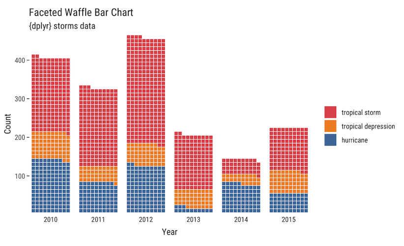](https://github.com/hrbrmstr/waffle)

## `ggbump`

[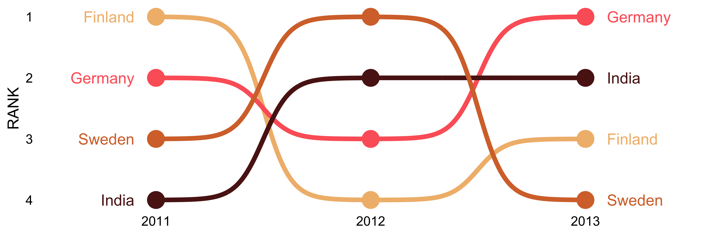](https://github.com/davidsjoberg/ggbump)

## `ggstream`

[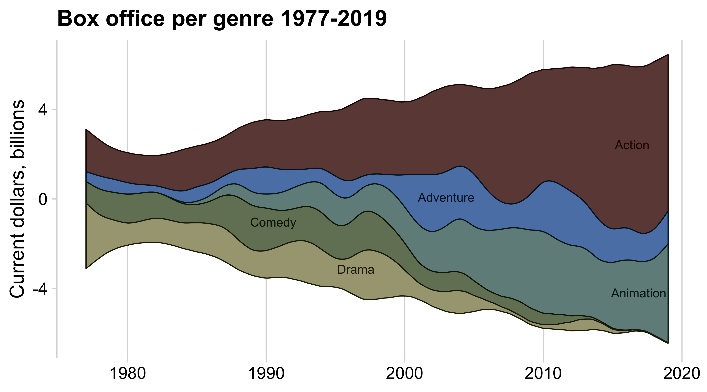](https://github.com/davidsjoberg/ggstream)

## `ggridges`

[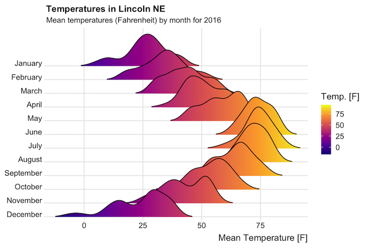](https://wilkelab.org/ggridges)

## `ggbeeswarm`

[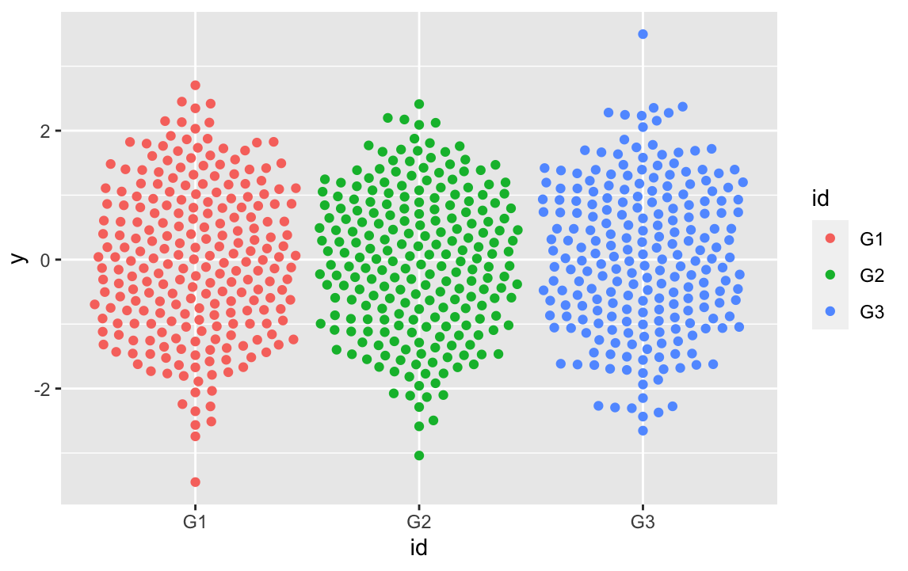](https://github.com/eclarke/ggbeeswarm)

## `gganimate`

[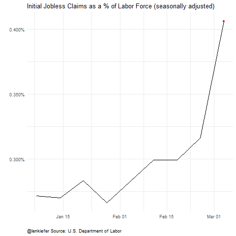](http://lenkiefer.com/2020/04/03/us-labor-market-update-april-2020/)

## `patchwork`

[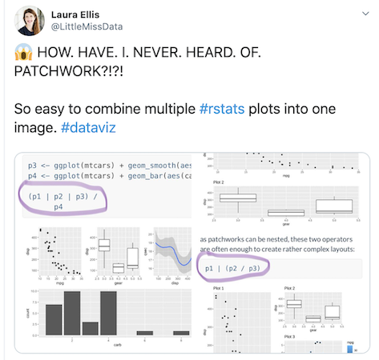](https://twitter.com/littlemissdata/status/1229176433123168256)

## `patchwork`

[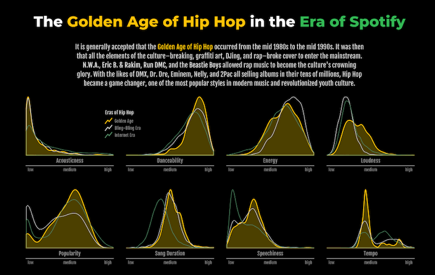](https://github.com/Z3tt/TidyTuesday#week-202004--spotify-songs-by-spotify-via-spotifyr)

## Your Turn {.your-turn}

1. Make a plot using a new (to you) geom. You can use the ones I've shown in this lesson or you can find more on the [Awesome ggplot2 GitHub repository](https://github.com/erikgahner/awesome-ggplot2).

1. If you come up with something you'd like to share, please email it to me at <david@rfortherestofus.com>.
